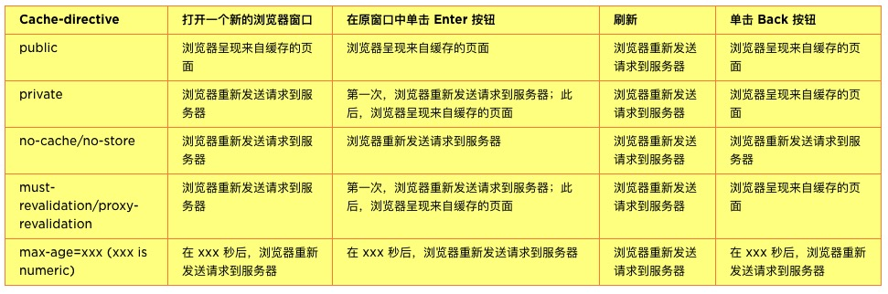
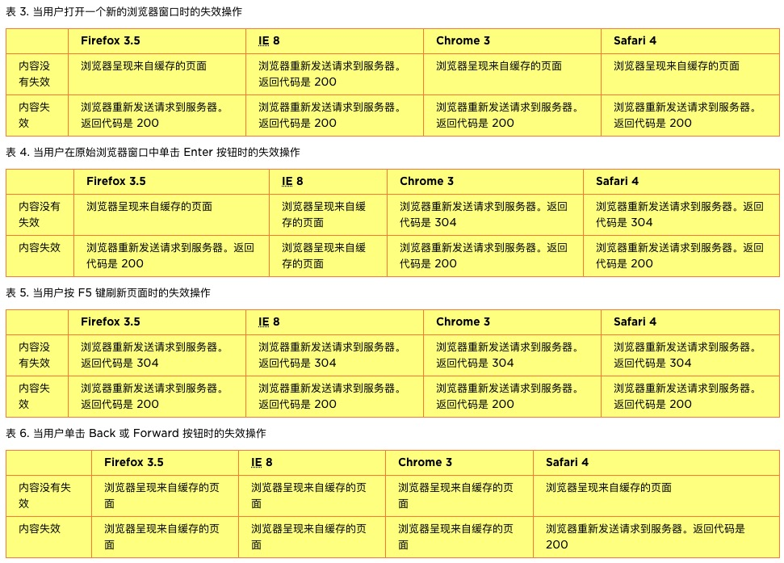
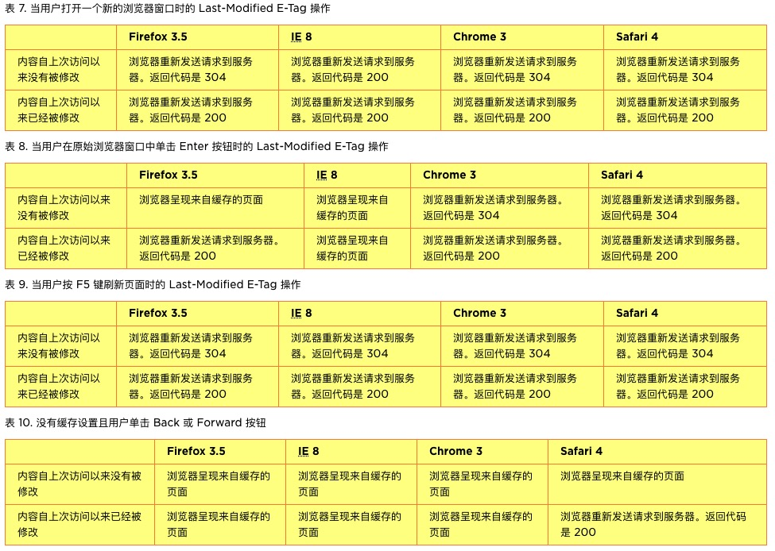
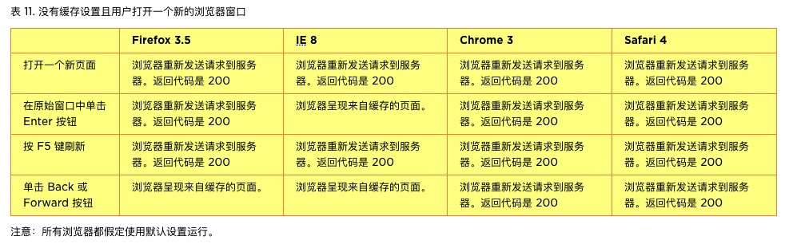
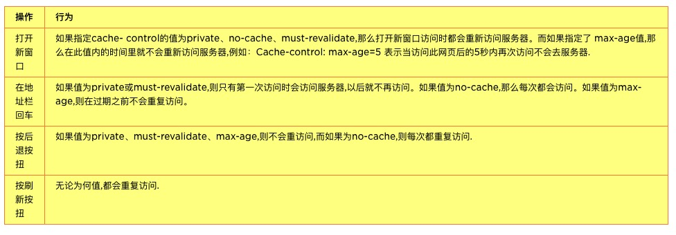

# 缓存

## 缓存知识

Http 缓存机制作为 web 性能优化的重要手段，对从事 Web 开发的小伙伴们来说是必须要掌握的知识，但最近我遇到了几个缓存头设置相关的题目，发现有好几道题答错了，有的甚至在知道了正确答案后依然不明白其原因，可谓相当的郁闷呢！！为了确认下是否只是自己理解不深，我特意请教了其他几位小伙伴，发现情况也或多或少和我类似。

- [彻底弄懂 Http 缓存机制 - 基于缓存策略三要素分解法](https://mp.weixin.qq.com/s/qOMO0LIdA47j3RjhbCWUEQ)

- [你可能不知道的 cookie](http://eux.baidu.com/blog/fe/%e4%bd%a0%e5%8f%af%e8%83%bd%e4%b8%8d%e7%9f%a5%e9%81%93%e7%9a%84cookie)

## 浏览器缓存机制详解

浏览器缓存就是当你打开一个网页，浏览器会自动下载副本到你电脑上，就相当于你另存为网页到某个地方而已，只不过这里是自动而已。当然不是浏览器能把各种 网页都能下载到本地电脑上，它是有特殊情况。一般 html，后者 request 是 get 请求，而 post 一般不缓存。（这个后面会说到）

当然客户端缓存是否需要是可以在服务端代码上控制的。那就是响应头。

响应头告诉缓存器不要保留缓存，缓存器就不会缓存相应内容；

如果请求信息是需要认证或者安全加密的，相应内容也不会被缓存；

校验参数非常重要，如果回应中 1 个参数都不存在，并且没有任何信息说明保鲜期（Expires 或 Cache-Control）的情况下，缓存将不会存储任何副本； 最常见的校验参数是文档的最后修改时间，通过最后 Last-Modified 头信息可以，当一份缓存包含 Last-Modified 信息，他基于此信息，通过添加一个 If-Modified-Since 请求参数，向服务器查询：这个副本从上次查看后是否被修改了。 HTTP 1.1 介绍了另外一个校验参数： ETag，服务器是服务器生成的唯一标识符 ETag，每次副本的标签都会变化。由于服务器控制了 ETag 如何生成，缓存服务器可以通过 If-None-Match 请求的返回没变则当前副本和原件完全一致。 所有的缓存服务器都使用 Last-Modified 时间来确定副本是否够新，而 ETag 校验正变得越来越流行。

响应头如果是 POST 模式递交数据，则返回的页面大部分不会被浏览器缓存，如果你发送内容通过 URL 和查询（通过 GET 模式），则返回的内容可以缓存下来供以后使用。

HTTP 协议中关于缓存的信息头关键字包括 Cache-Control(HTTP1.1)，Pragma(HTTP1.0)，last-Modified，Expires 等。

缓存控制头 Cache-Control
Cache-Control 是最重要的规则。这个字段用于指定所有缓存机制在整个请求/响应链中必须服从的指令。这些指令指定用于阻止缓存对请求或响应造成不利干扰的行为。这些指令 通常覆盖默认缓存算法。缓存指令是单向的，即请求中存在一个指令并不意味着响应中将存在同一个指令。

cache-control 定义是：Cache-Control = “Cache-Control” “:” cache-directive。表 1 展示了适用的值。

表 1. 常用 cache-directive 值
| Cache-directive | 说明 |
| ------------- | ------------- |
|public|所有内容都将被缓存|
|private|内容只缓存到私有缓存中|
|no-cache|所有内容都不会被缓存|
|no-store|所有内容都不会被缓存到缓存或 Internet 临时文件中|
|must-revalidation/proxy-revalidation|如果缓存的内容失效，请求必须发送到服务器/代理以进行重新验证|
max-age=xxx (xxx is numeric)|缓存的内容将在 xxx 秒后失效, 这个选项只在 HTTP 1.1 可用, 并如果和 Last-Modified 一起使用时, 优先级较高|

表 2 表明在不同的情形下，浏览器是将请求重新发送到服务器还是使用缓存的内容。

表 2. 对 cache-directive 值的浏览器响应

Cache-Control 是关于浏览器缓存的最重要的设置，因为它覆盖其他设置，比如 Expires 和 Last-Modified。另外，由于浏览器的行为基本相同，这个属性是处理跨浏览器缓存问题的最有效的方法。

### 过期头 (Expires)

Expires 头部字段提供一个日期和时间，响应在该日期和时间后被认为失效。失效的缓存条目通常不会被缓存（无论是代理缓存还是用户代理缓存）返回，除非首先通过原始 服务器（或者拥有该实体的最新副本的中介缓存）验证。（注意：cache-control max-age 和 s-maxage 将覆盖 Expires 头部。）

Expires 字段接收以下格式的值：“Expires: Sun, 08 Nov 2009 03:37:26 GMT”。如果查看内容时的日期在给定的日期之前，则认为该内容没有失效并从缓存中提取出来。反之，则认为该内容失效，缓存将采取一些措施。表 3-6 表明针对不同用户操作的不同浏览器的行为。

表 3. 当用户打开一个新的浏览器窗口时的失效操作

注意：所有浏览器都假定为使用默认设置运行。

### 控制文件是否有修改 Last-Modified/E-Tag

Last-Modified 实体头部字段值通常用作一个缓存验证器。简单来说，如果实体值在 Last-Modified 值之后没有被更改，则认为该缓存条目有效。ETag 响应头部字段值是一个实体标记，它提供一个 “不透明” 的缓存验证器。这可能在以下几种情况下提供更可靠的验证：不方便存储修改日期；HTTP 日期值的 one-second 解决方案不够用；或者原始服务器希望避免由于使用修改日期而导致的某些冲突。

不同的浏览器有不同的配置行为。表 7-10 表明针对不同用户操作的不同浏览器的行为。

注意：所有浏览器都假定使用默认设置运行。

### 不进行任何缓存相关设置

如果您不定义任何缓存相关设置，则不同的浏览器有不同的行为。有时，同一个浏览器在相同的情形下每次运行时的行为都是不同的。情况可能很复杂。另外，有些不该缓存的内容如果被缓存，将会导致安全问题。 不同的浏览器有不同的行为。表 11 展示了不同的浏览器行为。

表 11. 没有缓存设置且用户打开一个新的浏览器窗口

### 关键结论

最后, 概括下关键的结论

